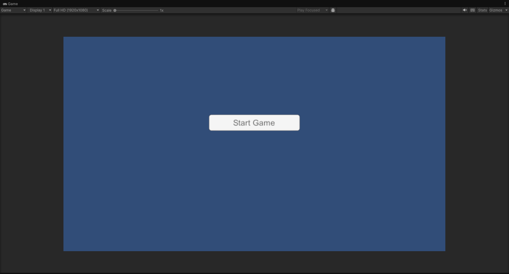
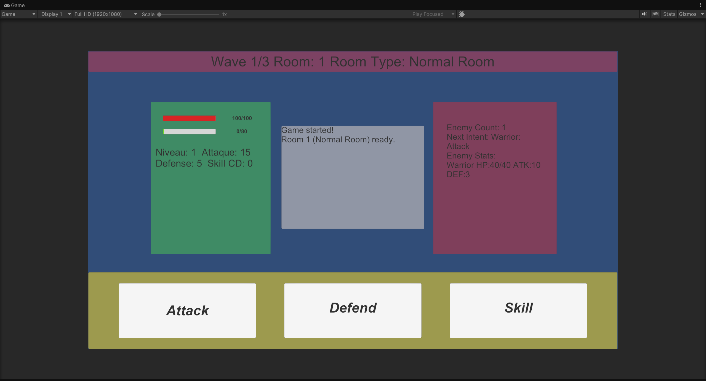
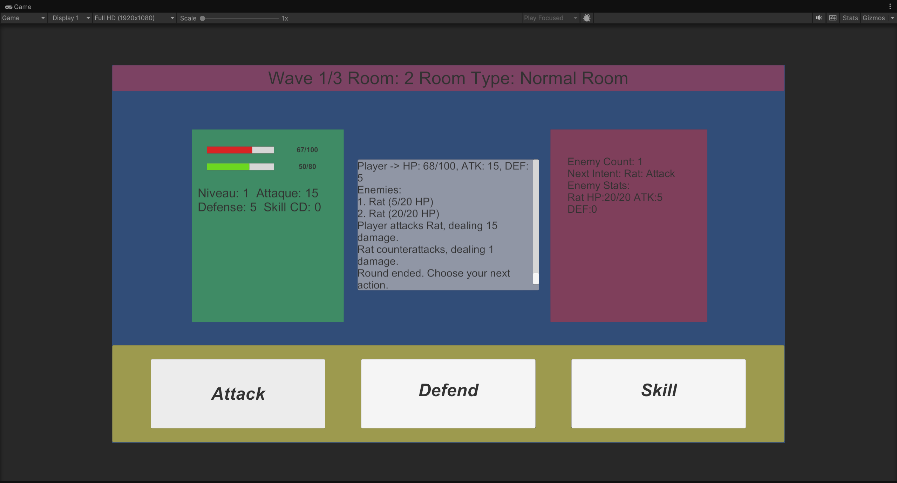
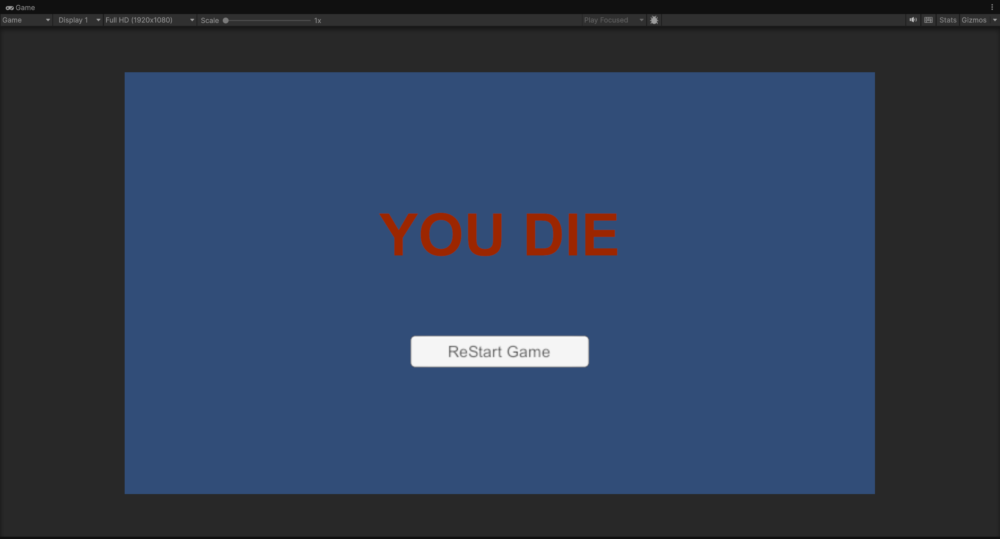
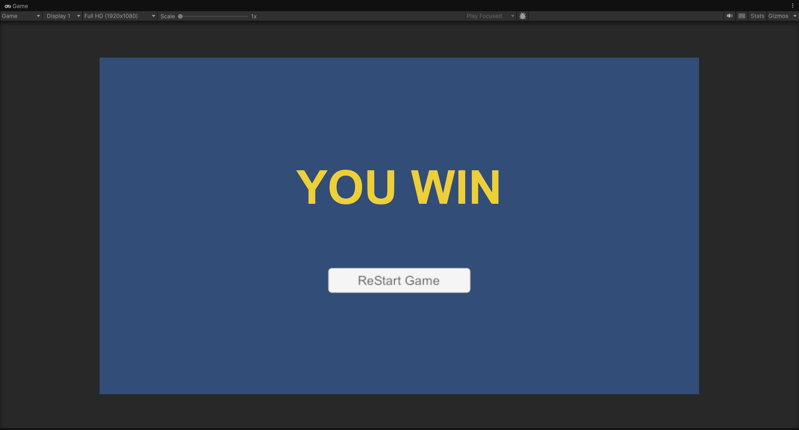
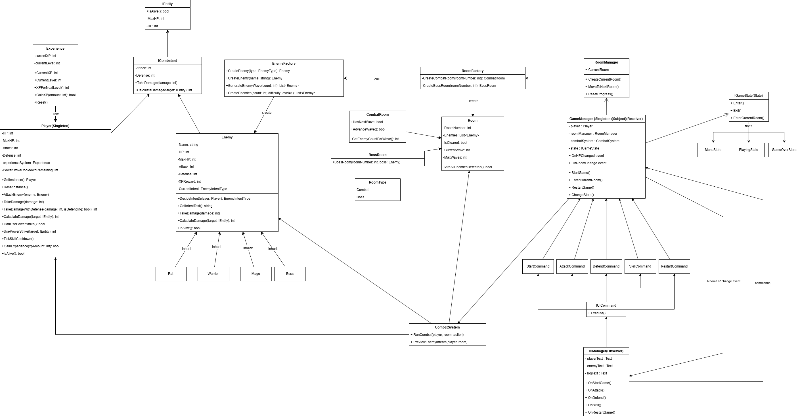

# Roguelike Dungeon (Unity-Only)

A turn-based roguelike dungeon project built with Unity.

This project uses a Unity-only architecture. Core gameplay logic that was previously split into an external .NET backend has been migrated back into the Unity source code, so no extra DLL build or integration pipeline is required. This makes iteration and debugging much faster.

## What This Project Is

Roguelike Dungeon is a combat-focused prototype. The current goal is to deliver a fully playable vertical slice first, then expand depth and content step by step.

The current version focuses on:

- A clear turn-based combat loop
- Wave progression with explicit win/lose feedback
- Low coupling between core logic and UI structure

## Tech Stack

- Engine: Unity
- Language: C#
- Architecture: Unity-only (no external backend DLL)
- Core code path: `UnityClient/Assets/Scripts/GameCore/`
- Main modules:
	- `enemy/` (enemies and behavior)
	- `player/` (player stats and combat behavior)
	- `manager/` (flow and state management)
	- `room/` (room and progression logic)
	- `equipment/` (equipment and progression-related systems)

## What Has Been Completed

### 1) Architecture and Engineering

- Completed Unity-only migration; gameplay logic is now maintained in Unity source code
- Separated core game logic from presentation scripts (GameCore vs UI/Scene scripts)
- Implemented state-driven game flow (menu / in-game / result)

### 2) Combat and Gameplay Flow

- Implemented the core turn loop: player action -> enemy action -> resolution
- Implemented player actions: normal attack, skill, defend, restart
- Added multiple enemy types with basic intent behavior (such as attack/defend)
- Integrated wave-based progression and final win/lose checks
- Implemented result UI states (`YOU DIE` / `YOU WIN`)

### 3) Visuals and Documentation

- Added full gameplay flow screenshots (start, combat, defeat, victory)
- Organized design structure docs, balance docs, and workflow docs

## Current Win/Lose Rules

- Lose condition: player HP <= 0
- Win condition: defeat the final boss room

## Quick Start

1. Open `UnityClient/` in Unity Editor.
2. Edit gameplay logic in `Assets/Scripts/GameCore/`.
3. Press Play to validate behavior.
4. Commit Unity source changes and related documentation updates.

## 项目结构

```text
CSharp-Roguelike-Dungeon/
|- UnityClient/
|  |- Assets/
|  |  |- Scripts/
|  |  |  |- GameCore/
|- Docs/
|- Imgs/
|- README.md
```

## What Can Be Added Next

### 1) Gameplay Depth

- Expand the skill system: multiple skill slots, skill branches, status effects (poison/burn/vulnerability, etc.)
- Improve enemy AI with clearer behavior patterns and intent readability
- Add event rooms, shop rooms, and treasure rooms for a more complete run structure

### 2) Progression and Build Variety

- Expand the equipment system: affixes, rarities, and set synergies
- Add in-run progression choices (pick-one-of-three talents, post-battle rewards)
- Add light meta progression (character unlocks, starter items)

### 3) Balancing and Testability

- Move key combat values into ScriptableObjects or config data
- Add play mode / edit mode tests (combat, leveling, result flow)
- Add debug panels and battle log metrics to support balancing iterations

### 4) Experience Polish

- Improve combat feedback: damage numbers, hit reactions, layered SFX
- Improve UI readability: intent hints, cooldown display, status icons
- Add onboarding and first-run tutorial to reduce learning friction

## Screenshots

### Start Screen



### Game Start



### Gameplay



### Game Over



### Victory



### UML Diagram



Last updated: 2026-04-07
